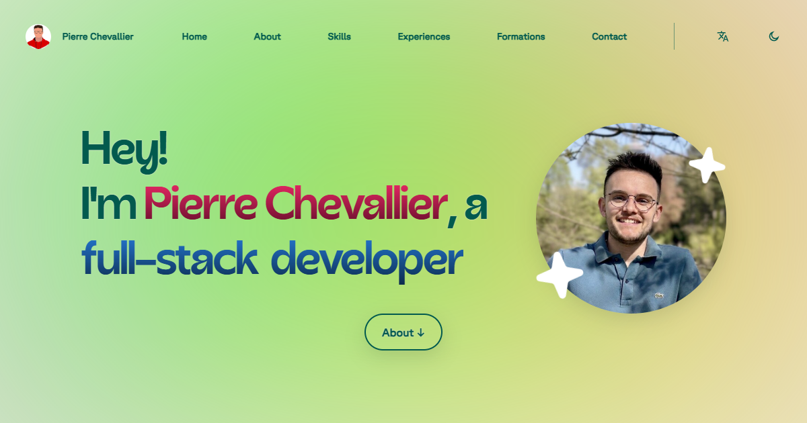

# Portfolio

Personal portfolio website of **Pierre Chevallier**, built with Angular.

It features several sections: Home, About, Skills, Professional Experience, Education, and Contact, available in both **English and French**.



## Access

- The website is available at: [pierre-chevallier.com](https://pierre-chevallier.com)

## Features

- 🌐 **Bilingual content** (EN/FR) — content is loaded dynamically based on the selected language, with the choice persisted in `localStorage`
- ⚡ **Server-Side Rendering (SSR)** via Angular Universal for better performance and SEO
- 🎬 **Scroll-triggered animations** — sections animate into view as the user scrolls (`InView` directive)
- 🌗 **Dark and light mode** toggle, with the preference persisted for future visits
- 📱 **Responsive design** for desktop and mobile
- ♿ **Accessible** website design
- ✅ Built according to web development **best practices**
- 🔍 **Search engine optimized (SEO)** and achieving a strong **Lighthouse** score
- 🖋 **Signal-based reactivity** using modern Angular (standalone components, signals, `inject()`)

## Tech stack

- Angular (latest version) using standalone components and Signals
- TypeScript
- SCSS
- Express (SSR server)

## Project structure

```
src/app/
├── content/     # Loads the text content of the website from JSON files and provides them to the app.
├── core/        # Holds singleton services, guards, interceptors, and app-wide infrastructure.
├── layout/      # Defines the application's structural UI (header, footer, navigation, shells).
├── sections/    # Page sections: home, about, skills, experiences, education, contact.
└── shared/      # Reusable directives, animations, components, pipes, and style utilities.

public/
├── content/     # JSON files that contain the website's content in English and French
├── fonts/       # Custom fonts
├── images/      # Images used in the website
└── resume/      # Resume PDFs (resume-en.pdf, resume-fr.pdf)
```

## Author

Fully designed and developed by **Pierre Chevallier**

- GitHub: [pierre-chevallier357](https://github.com/pierre-chevallier357)
- LinkedIn: [Pierre Chevallier](https://www.linkedin.com/in/pierre-chevallier/)
